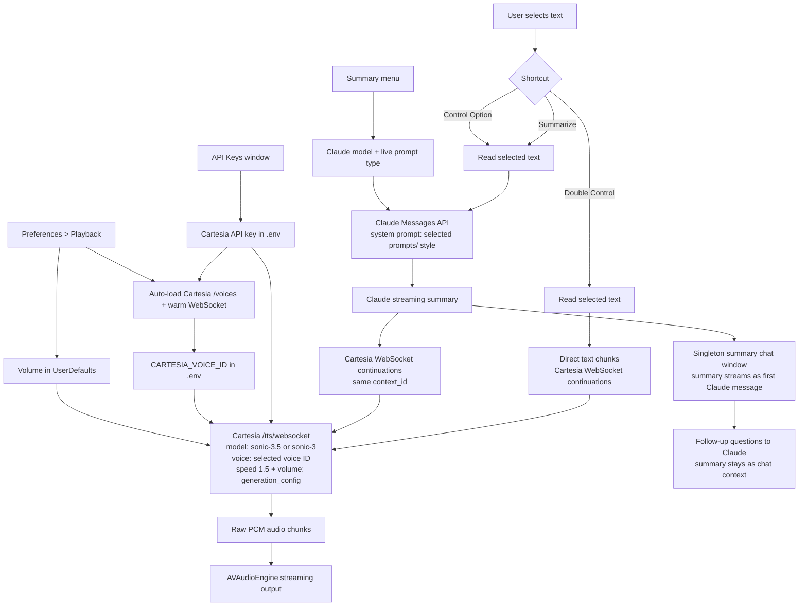

# AI Reader

AI Reader is a native macOS menu-bar app shell for selected-text-to-speech.

Default local shortcuts:

- Double Control: read selected text.
- Summarize: summarize selected text and show it in the reusable summary chat window.
- Control Option: summarize selected text, show it in the reusable summary chat window, then read the summary.
- Control A: rewind 10 seconds while AI Reader is speaking.
- Control S: pause/resume while AI Reader is speaking.
- Control D: fast-forward 10 seconds while AI Reader is speaking.
- Control B: stop the current audio and cancel the active TTS stream.

The live flow reads the current macOS selected text through Accessibility first. Select text in the focused app, then trigger AI Reader:

- Double Control reads the current selected text, splits it into phrase-sized segments, streams those segments to the selected Cartesia Sonic model over warm WebSocket continuations at fixed 1.5x speed, and starts playback as audio chunks arrive.
- Summarize reads the current selected text, streams it to Claude with the selected prompt style from the `prompts/` folder as the system prompt, then shows summary text as it arrives in a reusable chat window.
- Control Option reads the current selected text, streams it to Claude with the selected prompt style from the `prompts/` folder as the system prompt, shows summary text as it arrives in the same reusable chat window, then feeds summary chunks into the selected Cartesia Sonic model with WebSocket continuations.

If Accessibility cannot read selected text from the focused UI element, AI Reader falls back to the current clipboard text and reports the direct-selection failure that caused the fallback. If both direct selection and clipboard fallback fail, the app reports the direct-selection failure instead of silently asking for copied text.

AI Reader requests Accessibility for the keyboard event tap used by shortcuts and for direct selected-text capture.

## Cartesia Flow



## Local Setup

```sh
cp .env.example .env
./script/build_and_run.sh
```

The default local build installs a stable development app at `/Applications/AI Reader Dev.app`
so macOS privacy grants survive rebuilds. For clean-room TCC tests, run
`AI_READER_APP_IDENTITY=permission-test ./script/build_and_run.sh`.

Provider API keys pasted in the app are stored in `.env` for this local development build. Cartesia voices load automatically after the key is saved, `CARTESIA_VOICE_ID` is selected automatically when needed, and model, volume, and voice can be changed from the menu. Speech sends Cartesia a fixed 1.5x speed request. Summary instructions live in editable files under `prompts/`, with Boil Down selected by default. The selected prompt file is read fresh from disk for each Claude generation, so prompt edits apply on the next summary without restarting AI Reader. The Claude summary model can be changed from the menu.

The menu and summary window show the latest timing report across capture, window display, Claude response headers, first streamed text, Claude completion, Cartesia continuation send, first audio chunk, and first audio scheduled locally. The aggressive TTS target is 50 ms from trigger to first audio scheduled locally; real end-to-end results still depend on network, Claude first-token time, and Cartesia first-chunk time.

## Release Smoke

Build a local signed candidate, then smoke the built app and DMG:

```sh
AI_READER_PUBLIC_RELEASE=0 AI_READER_RELEASE_VERSION=1.3.0 ./script/package_release.sh
AI_READER_RELEASE_VERSION=1.3.0 ./script/release_smoke.sh --allow-unnotarized
```

`script/release_smoke.sh` verifies the release app version, bundle id, official app identity, Developer ID signing identity, hardened runtime flag, app and DMG codesign checks, DMG contents (`AI Reader.app` plus the `/Applications` symlink), the permission probe against the release bundle without mutating `/Applications/AI Reader Dev.app`, and the launch-at-login probe's changeable state.

The smoke script does not need notarization credentials and does not submit anything to Apple. For a public release, it exits non-zero until the DMG is notarized, stapled, and accepted by Gatekeeper. To run the public-release gate after notarized packaging, use:

```sh
AI_READER_NOTARY_PROFILE=<keychain-profile> AI_READER_RELEASE_VERSION=1.3.0 ./script/package_release.sh
AI_READER_RELEASE_VERSION=1.3.0 ./script/release_smoke.sh
```

`AI_READER_PUBLIC_RELEASE=0` is only for local signed candidates. Public release artifacts must be produced with `AI_READER_NOTARY_PROFILE=<keychain-profile>` so `package_release.sh` can submit, wait, staple, and validate before the release smoke gate.
