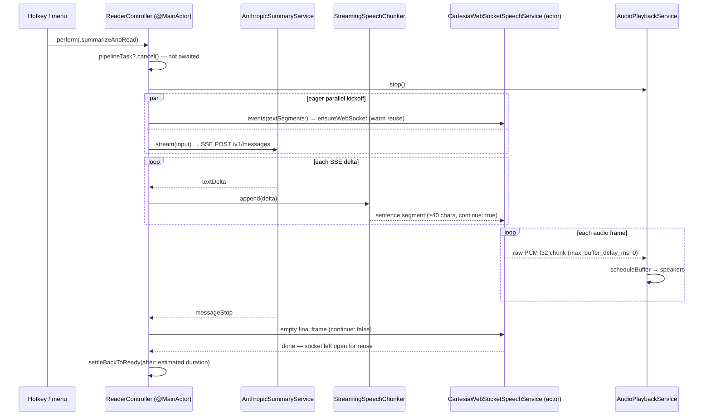

# Streaming pipeline architecture review

**Branch:** `refactor/streaming-pipeline-lifecycle` · **Date:** 2026-06-11
**Scope:** current-state audit of the text → Claude → Cartesia → audio pipeline, written before the lifecycle refactor so the "before" behavior and the latency contract are both on record.

The product hits its speed goal — time-to-first-audio has an explicit 50 ms target (`ReaderController.swift:39`) and the latency report distinguishes warm vs cold socket paths (`ReaderController.swift:1107`). But lifecycle management has three user-visible failures:

- (a) multiple read pipelines can run concurrently,
- (b) stopping is unreliable,
- (c) network connections stay open too long, tripping API usage/concurrency limits.

This document maps the architecture, inventories the speed mechanisms that must survive the refactor, and pins each failure to its root cause.

## 1. Happy path today (`summarizeAndRead`)

Key flow facts:

1. Every entry point (hotkeys, menu buttons, the two API-key test buttons) funnels into `ReaderController.perform(_:)` on the main actor and ultimately writes the single `pipelineTask` slot (`ReaderController.swift:593-600`, `378-380`, `409-411`).
2. When speaking, the Cartesia speech task is started **before** the Claude request is sent (`ReaderController.swift:734-739`), so the WebSocket handshake overlaps Claude's time-to-first-token.
3. Claude deltas flow through `StreamingSpeechChunker` (`ReaderController.swift:1302-1369`) into a `TextSegmentStreamBridge` (`:1277-1300`) consumed by the Cartesia actor, which sends each segment with `continue: true` on one `context_id` (`CartesiaSpeechService.swift:333-367`).
4. Audio returns as raw PCM float32 mono 44.1 kHz with `max_buffer_delay_ms: 0`; each chunk is scheduled immediately on a pre-warmed `AVAudioEngine`/`AVAudioPlayerNode` (`AudioPlaybackService.swift:100-132`).
5. Completion is **estimated**: `settleBackToReady` flips `status` back to `.ready` on a clamped timer, not a playback event (`ReaderController.swift:1112-1127`); all `scheduleBuffer` completion handlers are `nil` (`AudioPlaybackService.swift:124`).

## 2. Why it is fast — preserve these

| # | Mechanism | Evidence |
|---|-----------|----------|
| S1 | Persistent, pre-warmed Cartesia WebSocket: reused across reads, validated by ping with a 3 s skip window, pre-warmed on shell refresh. Skips TLS + WS handshake on the hot path — the single biggest TTFA lever. | `CartesiaSpeechService.swift:416-454`, `:160-162`; `ReaderController.swift:800-836` |
| S2 | Eager parallel kickoff: the speech task (socket ensure) starts before the Claude request is even sent, hiding the handshake behind Claude TTFT. | `ReaderController.swift:734-739` |
| S3 | Stream-while-generating: deltas → chunker → Cartesia continuations; audio starts on the first sentence, not the last token. | `ReaderController.swift:748-756`; `CartesiaSpeechService.swift:338-352` |
| S4 | Early-flush chunker: first segment at the first punctuation past 40 chars; forced boundary at 180 (min 90), split on whitespace. | `ReaderController.swift:1302-1358` |
| S5 | Zero-overhead audio path: raw PCM f32 (no container/decode), `max_buffer_delay_ms: 0`, engine pre-started at init, every chunk scheduled immediately, no jitter buffer. | `CartesiaSpeechService.swift:568`, `:102`; `AudioPlaybackService.swift:85-132`; `ReaderController.swift:68` |

Secondary: 1.5× default speech speed, 16 MB max WS message size, live minimal request shape (single user message, `max_tokens` 1500).

## 3. Defects

| # | Symptom | Root cause | Evidence |
|---|---------|-----------|----------|
| P1 | Concurrent pipelines (a) | `startPipeline` does fire-and-forget preemption: `pipelineTask?.cancel()` is never awaited and the slot is immediately overwritten; no single-flight guard, debounce, or generation counter anywhere. The old run keeps streaming until its next cooperative checkpoint. | `ReaderController.swift:593-600`, `378-380`, `409-411` |
| P2 | Stop misses work (a, b) | Broken cancellation tree: `speechTask` and Cartesia's `senderTask` are unstructured `Task {}`s, so parent cancellation does not propagate; they are only cancelled in `catch` blocks that fire-and-forget stops can skip. `URLSessionWebSocketTask.receive()` is not cancellation-cooperative, so the receive loop can hang until the socket actually dies. | `ReaderController.swift:718`, `:985`; `CartesiaSpeechService.swift:333`, `:373`, `:456-478` |
| P3 | Cross-run socket corruption (a, b) | One shared `webSocketTask` on the actor; the receive loop yields every `chunk` without filtering by `context_id`, so a superseded run's audio can be scheduled into the new run's playback; the old run's `closeWebSocket()` can also kill the socket the new run just reused. | `CartesiaSpeechService.swift:157`, `:385-398`, `:411`, `:422-441` |
| P4 | Sockets held open → usage limits (c) | The success path returns with the socket deliberately left open; pre-warm opens it eagerly (including a 1/sec permission-poll loop); `.stop` never touches the socket; there is no idle TTL, no keepalive, and no public close API; `URLSession.shared` cannot be invalidated. | `CartesiaSpeechService.swift:311-314`, `:400-404`, `:507-512`, `:165`; `ReaderController.swift:135-142`, `:800-836`, `:438-446` |
| P5 | Claude teardown is indirect (b, c) | No `URLSessionTask` handle is retained for the SSE request; cancellation rides `AsyncThrowingStream.onTermination` → inner `Task.cancel()` → cooperative `bytes.lines`. Rapid re-triggers stack half-open streaming connections. The summary window's follow-up chat runs an untracked, uncancellable Task on a second `AnthropicSummaryService`. | `AnthropicSummaryService.swift:82-98`, `:158-214`; `SummaryWindowView.swift:13`, `:114` |
| P6 | Stop key goes dead; status lies (b) | `status` is a UI display value doubling as the work-state authority. It flips to `.ready` on a duration *guess* (fallback 0.9 s, clamp [0.9, 180]); its `didSet` then disables the playback hotkeys — so Ctrl+B/Ctrl+S stop working while audio is still audibly playing. | `ReaderController.swift:8-11`, `:648-649`, `:1112-1127`; `AudioPlaybackService.swift:124` |
| P7 | Pause leaks (c) | `.pauseResume` only pauses the player node; the Claude stream, WS receive loop, and pipeline task keep running, piling buffers onto a paused node and holding the socket busy. | `ReaderController.swift:96-107`; `AudioPlaybackService.swift:182-185` |

## 4. The core tension

S1 and P4 are the same code. The warm, reused socket is both the headline latency win and the usage-limit leak. The refactor must therefore change **ownership and policy**, not the reuse itself:

> Keep the transport warm and reusable; make every *use* of it owned by exactly one run, and give *idleness* a bounded lifetime.

## 5. Refactor invariants

1. **TTFA must not regress.** Warm-socket reuse, eager parallel kickoff, early chunk flush, pre-warmed engine, and the raw-PCM path all stay. The latency report (warm/cold tagging) is the regression check.
2. **Single flight.** Exactly one pipeline may drive the socket and audio engine at any instant. Starting a new read performs a bounded await of the previous run's teardown (preempt, not interleave).
3. **Deterministic stop.** Stop silences audio immediately, cancels the Claude stream and TTS context explicitly (retained task handles, explicit `cancel` frame + context teardown), and leaves no orphaned tasks. Structured concurrency throughout — no bare `Task {}` children on the pipeline path.
4. **Bounded idle.** A socket may stay open only while warm reuse is plausible; an idle TTL closes it afterward. Pre-warm remains, but is owned and cancellable.
5. **Context-scoped receive.** Audio frames are routed by `context_id`; frames from a cancelled context are dropped, never scheduled.
6. **State derives from work.** `status` is computed from the session's actual state and real playback-completion events (`scheduleBuffer` completion handlers / engine progress), not timers. Input gating (hotkeys) keys off real playback state.

## 6. Design decisions (resolved 2026-06-11)

1. **Preemption policy** — preempt, last trigger wins. A new trigger coalesces rapid repeats, cancels the active run, and awaits its teardown for a bounded grace period before starting.
2. **Socket idle policy** — keep-warm with an idle TTL. The socket survives between reads in an active session and auto-closes after sustained idleness; pre-warm is unchanged.
3. **Stop-grace bound** — 250 ms at the controller; if the old run is wedged past that, the Cartesia actor's cancel watchdog (600 ms) force-closes the socket and the next generation self-heals on a fresh connection.

## 7. Refactor outcome (2026-06-12)

Implemented on this branch; `swift build` clean, all 36 tests pass, live `--chained-summary-tts-probe` and `--playback-seek-probe` pass.

| Invariant | Implementation |
|-----------|----------------|
| Single flight (P1) | `ReaderController.requestPipeline` coordinator: latest request wins, rapid triggers coalesce, new run starts only after `teardownCurrentPipeline()` awaits the old run (250 ms grace, `preemptionGraceMilliseconds`). Test buttons route through the same coordinator. |
| Structured teardown (P2) | Speech work is an `async let` structured child of the pipeline (`streamClaudeSummary`, `streamCartesiaTextBySegments`) — cancelled and awaited automatically on scope exit. Cartesia cancellation is cooperative: `withTaskCancellationHandler` sends the cancel frame immediately (unblocking the receive loop via the server ack) instead of waiting for the next frame. |
| Context-scoped receive (P3) | Both receive loops drop frames whose `context_id` does not match the generation; a stale run can no longer feed audio into a new run. Error-path closes only the socket it owns (`closeWebSocket(ifCurrent:)`). |
| Bounded idle (P4) | `idleTimeout` (120 s) closes the socket after inactivity; every use or warm-up rearms it. Clean preemption keeps the socket warm (cancel frame, no close); only socket-level errors or the watchdog force-close it. Public `close()` exists and runs on controller deinit. |
| Deterministic Claude teardown (P5) | `AnthropicSummaryService.sendStreaming` cancels the underlying `URLSessionDataTask` (`bytes.task.cancel()`) via a cancellation handler — the SSE connection drops immediately on stop/preempt. The summary window's follow-up chat task is now tracked and superseded sends are cancelled. |
| State derives from work (P6) | `AudioPlaybackService` counts scheduled buffers with `.dataPlayedBack` completion callbacks and fires `onStreamingPlaybackFinished` when input is finished and the last buffer drains; `status` flips to `.ready` on that event. The settle timer remains only as a generous safety net (+5 s pad), so the stop hotkey no longer goes dead mid-playback. Enqueue requires an active streaming session, so post-stop chunks are dropped. |

Speed verification (cold socket, live probe): Cartesia connected at 168 ms, fully overlapped with Claude TTFT (1056 ms); first audio scheduled 178 ms after the first sentence was dispatched; 81 chunks / 2.4 MB streamed; eager kickoff, chunker thresholds, raw-PCM path, and warm-reuse logic untouched.

Tunable policy constants: `preemptionGraceMilliseconds` (ReaderController, 250 ms), `idleTimeout` (CartesiaWebSocketSpeechService init, 120 s), `cancelAcknowledgmentGrace` (CartesiaWebSocketSpeechService init, 0.6 s).

## 8. Interaction model changes (2026-06-12)

Built on the lifecycle machinery above; all flows route through the single-flight coordinator.

1. **Pause auto-closes after 2 minutes** (`pauseTeardownSeconds`). Users treat pause as stop, so a paused dictation tears down fully (Claude stream, TTS context, buffers) after the timeout — but the audio is banked first (`finishStreaming` before `stop`) so replay still works. Seeking while paused resets the timer.
2. **Ctrl+B stop hotkey removed.** Pause replaces stop; the keycode-11 mapping and the menu quick action are gone. `stopPlayback()` remains internal (used by preemption and the watchdog).
3. **Captured-text memory + replay-aware triggers.** `lastCapturedText` persists until new clipboard text replaces it. Ctrl+Option / double-Ctrl with an empty or unchanged clipboard replays the last banked audio ("hear it again"); with no audio banked it regenerates from the remembered text; new clipboard text starts a fresh run.
4. **Chat replies are spoken.** Summary-window follow-ups stream through `streamClaudeToSpeech` (the generalized Claude→window→Cartesia path): deltas append to the chat live while sentences stream into TTS. Degrades to text-only when Cartesia keys are missing. Replay covers chat replies because every spoken stream banks its audio.
5. **Read-aloud button** in the summary window speaks the latest assistant message via `speakText`.
6. **Prompt-type change regenerates.** Switching the summary style (menu bar or summary window) re-runs the remembered captured text with the new prompt and appends the result to the chat as the new summary context — spoken if the original summary was spoken.

---
*Findings produced by a three-agent code audit (Claude/text path, TTS/audio path, end-to-end lifecycle audit) on commit `de435cd`.*
